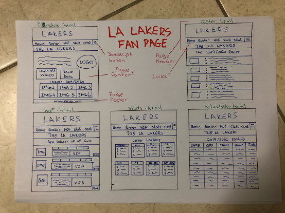
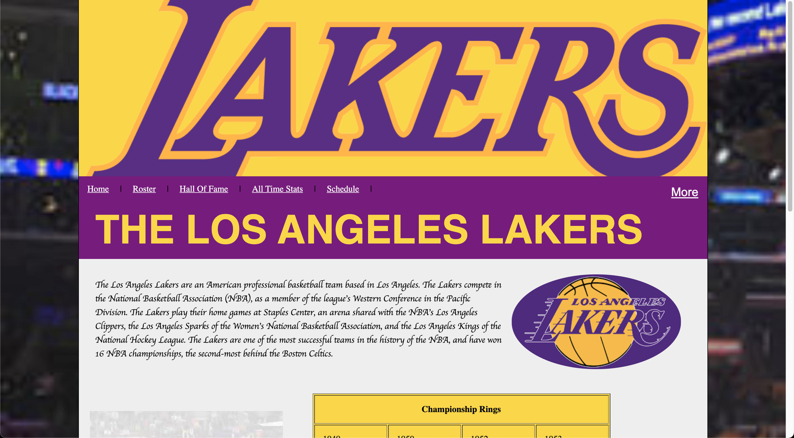
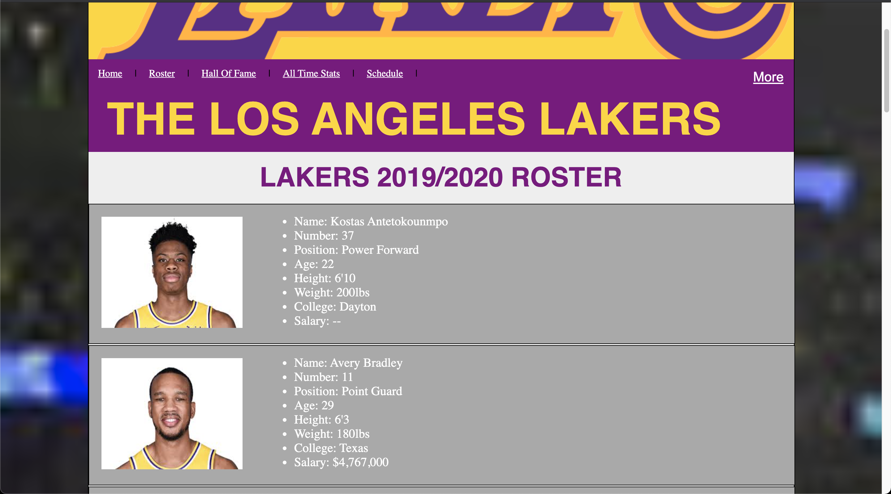
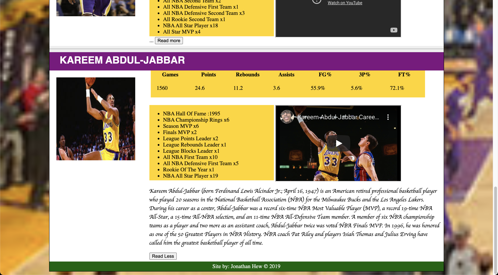
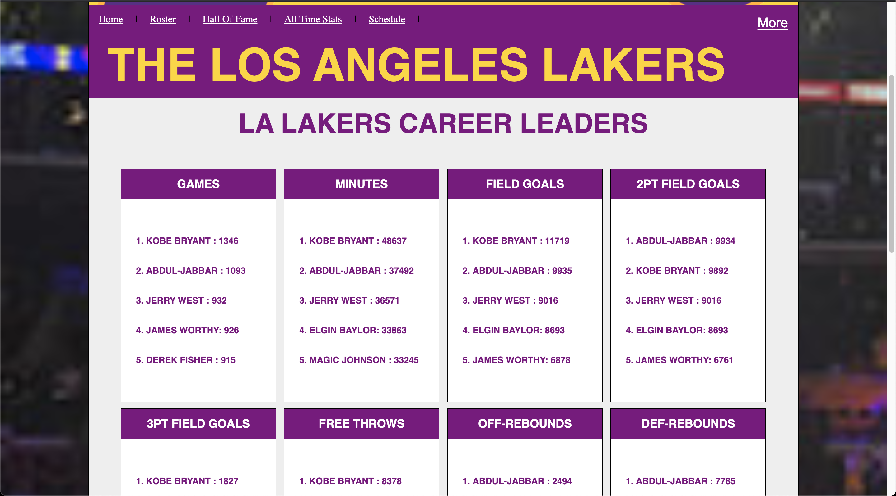
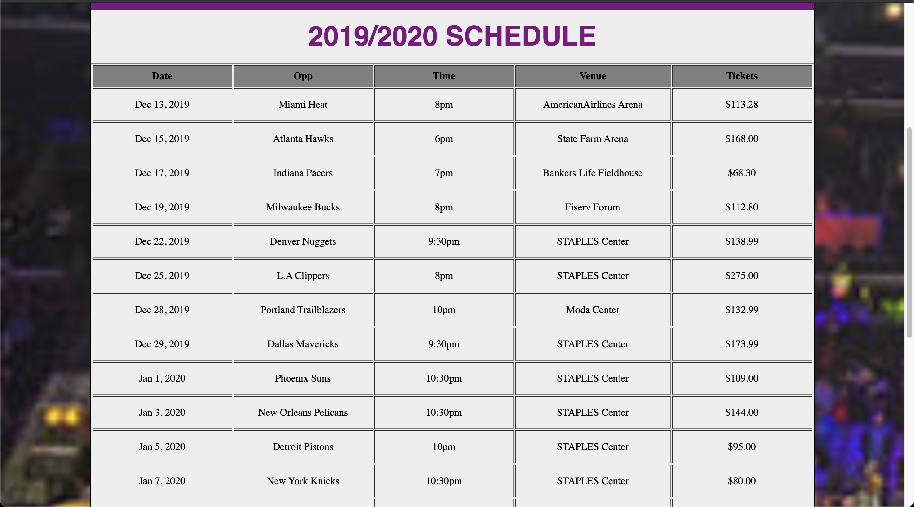
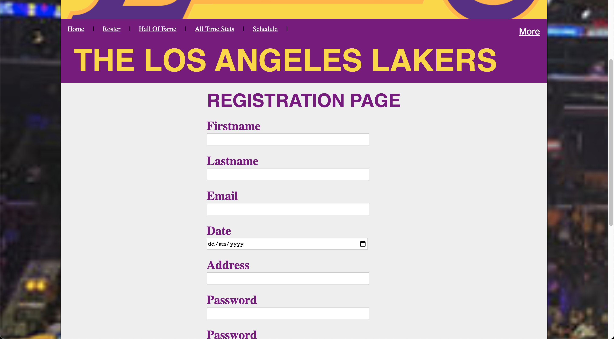
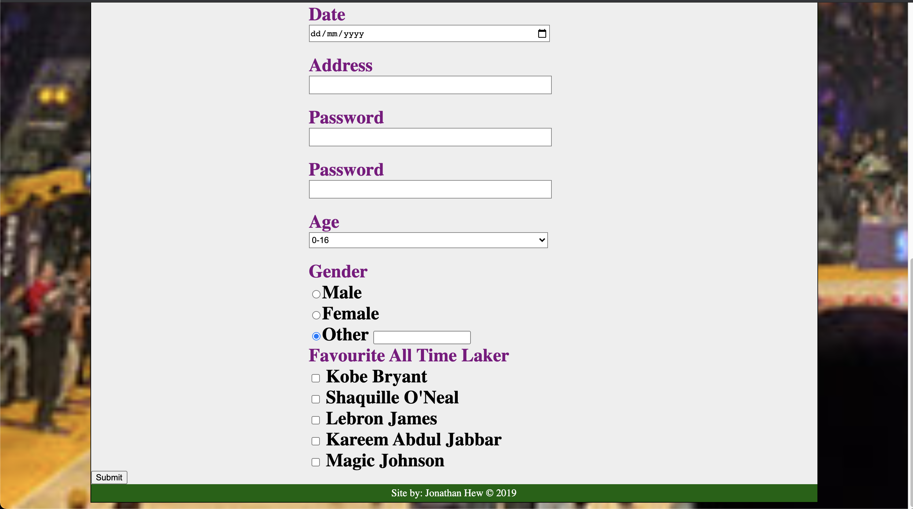
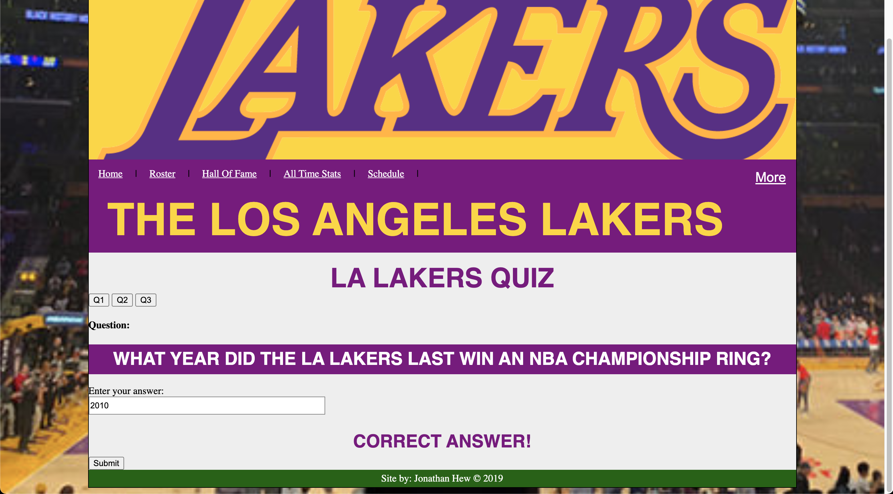

# LA Lakers Fan Page Website Project

Name: Jonathan Hew 

# Description of the assignment
For this project I created a website for the LA Lakers NBA Team. This website was designed for fans of the team which includes myself. The website was deigned using HTML, CSS and JavaScript. The HTML, CSS, JavaScript are all kept completely seperate.

The site includes the follwing functionality:
  - 5 Different content pages
  - Header Section
  - Menu Bar
  - Footer Section
  - Ordered List
  - Unordered List
  - Tabular Data Structure
  - Images
  - Videos
  - Variety of good HTML5 semantic tags and content
  - Embedded Content

The CSS contains the follwing functionality:
  - Responsive Design
  - Relative Metrics
  - Relative Paths
  - CSS Combinators
  - Reusable Styling for containers to offer consistent layout across all pages
  - CSS Style Reuse

The JavaScipt contains the following functionality:
  - A quiz which validates the user entry and returns if the answer is correct or incorrect. 

The website also contains a contact form with the follwoing functionality:
  - Text Input
  - Radio Buttons
  - Checkbox
  - Textarea
  - Dropdown List
  - Button

# Youtube Video Link 
Please click on the video image below to view the demo of this project.

[](https://youtu.be/k5Qmhsj2Ctc)
https://youtu.be/k5Qmhsj2Ctc

# Instructions
  - Download this project
  - Right click on index.html and open with Google Chrome


# How it works
For my website I used HTML5. I chose this version of HTML for many reasons. HTML5 added new semantics such as header, footer, section which were all used in my website. 

```HTML
<!DOCTYPE html>
```
The multimedia element video was also introduced in this version of HTML and I also used this tag in my website.
```HTML
<video width="350" height="280" controls>
  <source src="Assets/Videos/preseason.mp4" type="video/mp4">
	Your browser does not support the video tag.
</video>
```

For my website I also used CSS3. I chose this version of CSS because it was the latest version. This version also added new features to design HTML. For example I used the new “border-radius” feature to make an image turn from square to a more circular image.
```CSS
.textWithImage img
{
	margin: 10px;
	display:inline-block;
	border-radius: 50%;
	width: 27%;
}
```

When creating the website I added the following tag at the start also.
```HTML
<meta name="viewport" content="width=device-width, initial-scale=1">
```
I used percentages to design images and to also layout containers in order to make them responsive. I also used the VW (viewport width) to describe headings to make them responsive. However, I still ran into some difficulties in making specific page responsive in different viewport widths.


To create the website I first created everything that would be reused throughout all pages for example the header, links, footer, background image. I used classes to carry out reusable styling for containers to offer consistent layout across all pages. Once I completed this I copied and pasted the content onto the four other html files. I saved these all into a folder. 

This folder also contained an Assets folder. Inside the Assets folder included four more folder for CSS, Javascript, Images and videos. I used relative paths to access these folders. 

```HTML
<link rel="stylesheet" type="text/css" href="Assets/CSS/site.css">
<script src="Assets/Scripts/site.js"> </script>
```
This way my website folder was organised and it made it easy for me to find anything I needed. I then developed each page independently according to the content I wanted to offer on each page.

# Low Fidelity Prototype 


# What I am most proud of in the assignment
This was my first Web Dev project so I am very proud how it turned out. I was able to create a full website from scratch. What I am most proud of is how simple but effective the website is.After going through the website, the reader should be well educated on all about the LA Lakers. This website can solve many problems of not knowing much about the game of basketball. For example, if the reader doesn’t know what players play for the LA Lakers they can easily find out on the website. If they want to know who the Lakers will playing in their next game they can easily find that out also.

# Pages I created
## Home



## Roster


## Hall Of Fame


## Stats


## Schedule


## Registration



## Quiz

